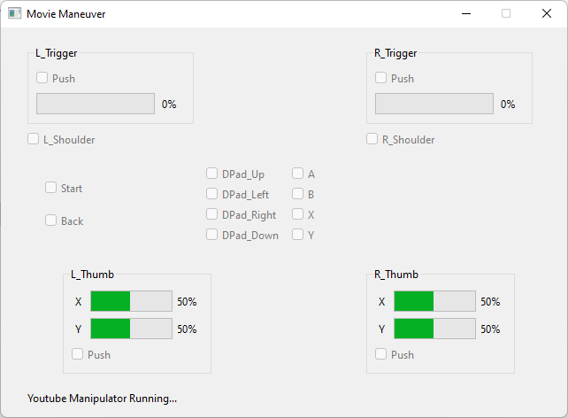

# Movie Maneuver

## 概要

XInput対応のゲームパッドからブラウザ(現状はChromeのみ)上で再生中の動画を操作できます。

## 使用方法
起動するとスクリーンショットのようなウィンドウが出て、裏で勝手にChromeでYoutubeもしくはUdemyの動画を再生しているかチェックします。
検出されると図のようにYoutube Manipulator Running...と表示されるので準備完了です。

### キーの割り当て(XInput)：
- A: 動画再生・ストップ
- B: (使用しません)
- X: ミュート切り替え
- Y: (使用しません)
- 方向キー上: 音量アップ
- 方向キー下: 音量ダウン
- 方向キー左: 5秒戻し
- 方向キー右: 5秒送り
- 左スティック上: 音量アップ
- 左スティック下: 音量ダウン
- 左スティック左: 5秒戻し
- 左スティック右: 5秒送り
- 右スティック上: 再生スピードアップ
- 右スティック下: 再生スピードダウン
- 右スティック左: 10秒戻し
- 右スティック右: 10秒送り
- Start: (使用しません)
- Back: (使用しません)

### キーの割り当て(WiiRemote)：
- 方向キー上: 音量アップ
- 方向キー下: 音量ダウン
- 方向キー左: 5秒戻し
- 方向キー右: 5秒送り
- A: 動画再生・ストップ
- B: ミュート切り替え
- 1: 10秒戻し
- 2: 10秒送り
- プラス: 再生スピードアップ
- ホーム: ミュート切り替え
- マイナス: 再生スピードダウン

## 動機
ブラウザでYoutubeやUdemyのチュートリアル動画を再生しながら手元でも作業をする際、動画を一時停止したい時などに通常は
- 作業中のウィンドウからマウスカーソルを移動
- ブラウザをクリック、各種操作
- 再度作業中のウィンドウをクリック

といった手間が発生しますが、それが面倒だったため作成しました。

## 仕様
- 最小化されていたり等ブラウザで動画を表示していないと機能しない
- ブラウザが他のウィンドウの後ろに隠れている場合、ちらつく（一瞬フォーカスをブラウザへ持っていく為）
- ブラウザ側で日本語入力が有効になっていると上手く動作しない
- 対応OSはWindows、ブラウザはChromeのみ
- 対応ゲームパッドはXInputの0番パッドのみ(DirectInputの場合はx360ceを使ってください)

## 既知の問題点
- キーコンフィグは無い
- ざっくり実装なので処理効率があまり良くない

## 更新履歴
### v0.0.3
- WiiRemotePlus(Wiiリモコンプラス)に対応
- アプリケーションを再起動しなくてもメニューからXInput/WiiRemoteの切り替え（再判定）が出来るように
- ボタンを連打した際に動画ウィンドウが選択状態でハイライト表示されてしまうのを回避
### v0.0.2
WiiRemote (Wiiリモコン) に対応
### v0.0.1
とりあえず公開
